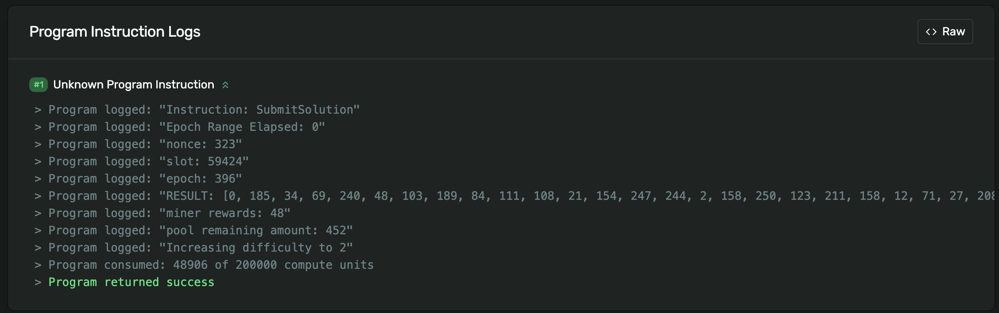
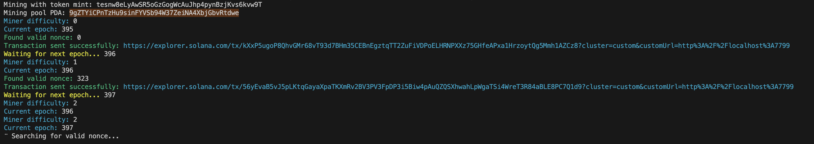
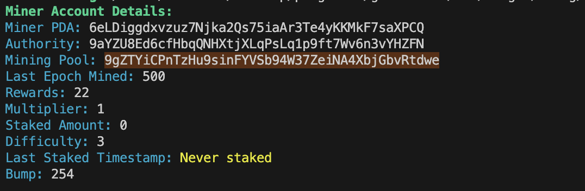

# MOR - Proof of Work Mining on Solana

MOR is a scalable Proof of Work (PoW) mining protocol built on Solana using Magicblock's Ephemeral Rollup. It enables anyone to mine tokens with minimal setup by offloading heavy mining computations off-chain while keeping token issuance and rewards trustless and verifiable on-chain.

## 🚀 Features

- **Scalable Mining**: Billions of hashes can be submitted per second without Solana network congestion
- **Cost Efficient**: No transaction fees during mining - only pay when claiming rewards or checkpointing
- **Trustless**: All rewards and token issuance verified on-chain via Solana smart contracts
- **Flexible**: Support for any SPL token through configurable mining pools

## 🏗️ Architecture

MOR is built on proven mining mechanics inspired by ORE, featuring:

- **Hash-based Proof of Work**: SHA3-256 based mining algorithm
- **Dynamic Difficulty Adjustment**: Automatic difficulty scaling based on network participation
- **Epoch-based Rewards**: Time-bounded mining periods for fair reward distribution
- **Ephemeral Rollup Integration**: Heavy computation handled off-chain on Magicblock's ER
- **Base Layer Settlement**: Final reward claims and account state settled on Solana

## 🔄 Mining Flow

1. **Pool Creation**: Admin creates a liquidity pool and deposits tokens for mining rewards
2. **Account Setup**: Users create their mining account for a specific token pool
3. **Delegation**: Miners delegate their account to Magicblock's Ephemeral Rollup
4. **Mining**: Continuous hash-based proof of work mining for tokens
5. **Undelegation**: After accumulating rewards, miners undelegate back to base layer
6. **Claiming**: Final reward claims executed on Solana base layer

## 📦 Installation

### Prerequisites

- [Rust](https://rustup.rs/) (latest stable version)
- [Solana CLI](https://docs.solana.com/cli/install-solana-cli-tools) (v2.2+)
- [Anchor Framework](https://www.anchor-lang.com/docs/installation) (v0.30+)

## 🔧 Development

### Local Development Setup

```bash
git clone https://github.com/magicblock-labs/magicblock-validator
./test-integration/configs/run-test-validator.sh # make sure all the files are available (goto ./test-integration/schedulecommit/sh/update run this script) PORT: 8899
cargo run -- configs/ephem-localnet.toml # start the magicblock's er PORT: 7799
# Deploy program locally
cd mor-core
anchor deploy
anchor create-token # creates a test token, you can edit the address in the test files

# Run CLI against local cluster
cd mor-cli
cargo run -- setup-keypair
```

### Running Tests

```bash
# Run Anchor tests
cd mor-core
anchor run test-name
```

- Test Order:
  - create-token
  - initialize-pool
  - delegate-reward-pool
  - initialize-miner
  - delegate-miner
  - submit-solution-er
  - undelegate-miner
  - claim-rewards

## 🛠️ CLI Commands

The MOR CLI provides all necessary tools for interacting with the mining protocol:

| Command            | Description                                   | Example                                                |
| ------------------ | --------------------------------------------- | ------------------------------------------------------ |
| `setup-keypair`    | Generate or import a Solana keypair           | `mor-cli setup-keypair`                                |
| `initialize-pool`  | Create a new mining pool with token deposits  | `mor-cli initialize-pool --token-mint <MINT> <AMOUNT>` |
| `create-account`   | Create your miner account for a specific pool | `mor-cli create-account --token-mint <MINT>`           |
| `delegate-miner`   | Delegate your miner to the Ephemeral Rollup   | `mor-cli delegate-miner --token-mint <MINT>`           |
| `mine`             | Start mining tokens from the pool             | `mor-cli mine --token-mint <MINT>`                     |
| `undelegate-miner` | Undelegate your miner back to base layer      | `mor-cli undelegate-miner --token-mint <MINT>`         |
| `claim-rewards`    | Claim accumulated mining rewards              | `mor-cli claim-rewards --token-mint <MINT>`            |
| `get-account`      | View miner account details and stats          | `mor-cli get-account --token-mint <MINT>`              |

## 🚀 Quick Start

### 1. Setup Your Wallet

```bash
# Generate a new keypair or import existing one
mor-cli setup-keypair
```

### 2. Initialize a Mining Pool (Admin Only)

```bash
# Create a pool with 500 tokens for mining rewards
mor-cli initialize-pool --token-mint tesnw8eLyAwSR5oGzGogWcAuJhp4pynBzjKvs6kvw9T 500
```

### 3. Create Your Miner Account

```bash
# Create account for the specific token pool
mor-cli create-account --token-mint tesnw8eLyAwSR5oGzGogWcAuJhp4pynBzjKvs6kvw9T
```

### 4. Delegate to Ephemeral Rollup

```bash
# Delegate your miner to start mining
mor-cli delegate-miner --token-mint tesnw8eLyAwSR5oGzGogWcAuJhp4pynBzjKvs6kvw9T
```

### 5. Start Mining

```bash
# Begin proof of work mining
mor-cli mine --token-mint tesnw8eLyAwSR5oGzGogWcAuJhp4pynBzjKvs6kvw9T
```

### 6. Claim Rewards

```bash
# When ready, undelegate and claim rewards
mor-cli undelegate-miner --token-mint tesnw8eLyAwSR5oGzGogWcAuJhp4pynBzjKvs6kvw9T
mor-cli claim-rewards --token-mint tesnw8eLyAwSR5oGzGogWcAuJhp4pynBzjKvs6kvw9T
```

## ⚙️ Configuration

### Environment Setup

```bash
# Set Solana cluster (localnet)
solana config set -ul

# Set your keypair path
solana config set --keypair ~/.config/solana/id.json
```

### Network Endpoints

- **Solana Base Layer**: `http://localhost:8899`
- **Ephemeral Rollup**: `http://localhost:7799`

## Proofs

</img>
</img>
</img>

## 🧠 Mining Algorithm

MOR uses a SHA3-256 based proof of work algorithm:

1. **Challenge Generation**: `SHA3(miner_pubkey + epoch)`
2. **Nonce Search**: Find nonce where `SHA3(challenge + nonce)` has leading zero bytes
3. **Difficulty**: Number of required leading zero bytes (adjusts dynamically)
4. **Epochs**: Mining periods of 150 slots (~60 seconds on Solana)

## 📊 Project Structure

```
mor/
├── mor-cli/           # Command line interface
│   ├── src/
│   │   ├── commands/  # CLI command implementations
│   │   ├── utils/     # Helper utilities and constants
│   │   └── main.rs    # CLI entry point
│   └── Cargo.toml
├── mor-core/          # Solana program (smart contract)
│   ├── programs/      # Anchor program code
│   ├── tests/         # Integration tests
│   ├── migrations/    # Deployment scripts
│   └── Anchor.toml
└── README.md
```

## 🤝 Contributing

1. Fork the repository
2. Create your feature branch (`git checkout -b feature/amazing-feature`)
3. Commit your changes (`git commit -m 'Add amazing feature'`)
4. Push to the branch (`git push origin feature/amazing-feature`)
5. Open a Pull Request

## 📄 License

This project is licensed under the MIT License - see the [LICENSE](LICENSE) file for details.

---

**Start mining today and earn tokens through proof of work on Solana! ⛏️💎**
